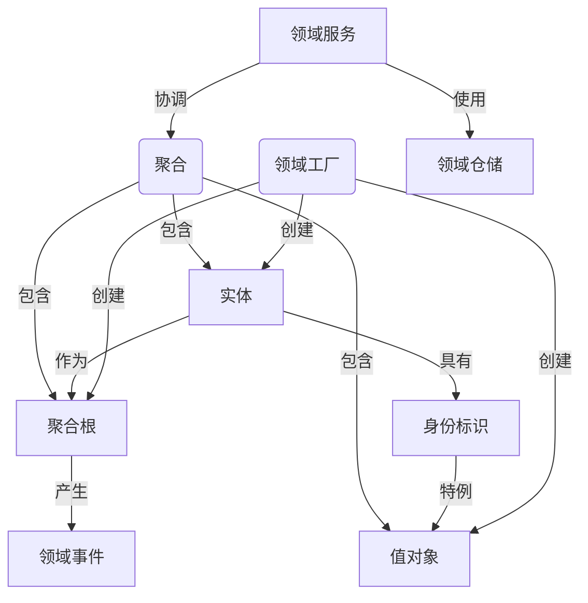
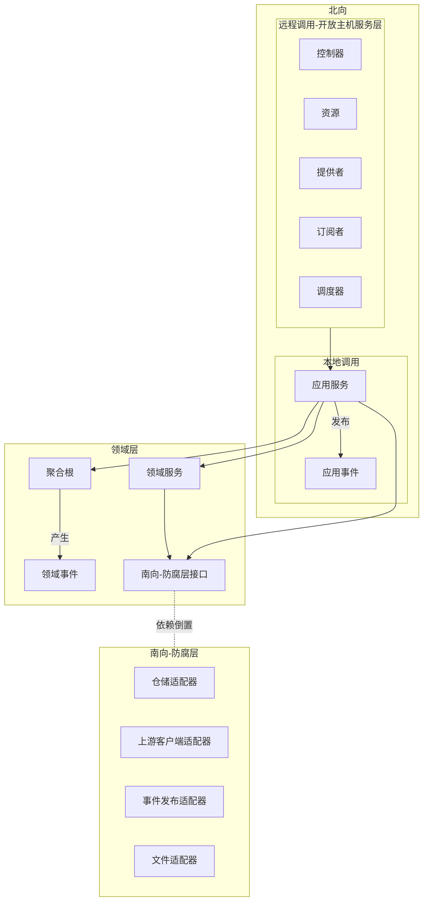

# 亚里士多德哲学

* 范畴定义：是对存在进行分类和描述的最高概念，通过主谓结构(subject is predication)来逻辑化地表达存在的特征和关系。
* 范畴内容：实体、数量、性质、关系、场所、时间、位置、状态、动作、受动。
* 本体结构：实体(独立存在)+属性(依附于实体存在)，实体范畴是存在的中心，是其它范畴的中心。其它范畴都依赖实体，存在于实体之中，不能脱离实体而独立存在，用来规定和说明实体范畴，因而可以概括为"  属性"范畴
* 主谓逻辑：实体是唯一能充当主语的范畴，其它九个属性范畴只能充当谓语

# 领域元模型

## 领域元模型定义

### 实体(Entity)

* 要描述主体，是不同变化状态的本体，具有唯一身份标识和独立生命周期。
* 身份标识：实体必要的标识符，区分不同实体对象的唯一标识，一般用值对象来表达。
* 属性：可以是另外的实体对象或者值对象。
* 行为：引起属性变化和状态迁移的动作。

### 值对象(Value Object)

* 用来规定和说明实体，它通常作为实体的属性、领域服务的参数或返回值
* 没有唯一身份标识，通过其属性值的组合来定义相等性。
* 不可变对象，其生命周期通常由所属实体或聚合管理，属性值变化会产生一个新的值对象实例。
* 拥有自我验证、自我组合、自我运算等领域行为。
* 可以表达细粒度的领域概念（业务含义、逻辑、验证等），相比于内建的基本类型更有优势。

### 身份标识(Identity)

* 实体的唯一标识，值对象的一个特例，具有值对象的特征。
* 无业务含义的通用类型身份标识
* 有业务含义的领域类型身份标识。

### 聚合(Aggregate)

* 将实体和值对象围绕一个边界组织成一个聚合，选择一个实体作为聚合的根，外部对象仅能持有聚合根的引用。
* 完整的领域概念整体，内部维护这个领域概念的完整性，由聚合根负责维护不变式。
* 一个整体参与业务行为的协作，是表达领域知识，封装领域逻辑的自治单元。
* 聚合是事务一致性的边界,聚合内部的不变式应在一次业务操作中得到维护；跨聚合协作通常通过领域事件或应用层编排实现最终一致性。
* 跨聚合的状态变更应通过领域事件或应用层编排实现最终一致性，避免使用分布式事务。
* 自治性体现为完整性、独立性、不变量(在数据变化时必须保持的一致性规则)和一致性。

### 聚合根(Aggregate Root)

* 外部对象只能持有聚合根的引用，并通过聚合根来修改聚合内部状态,负责维护聚合内部的一致性和完整性。
* 聚合根统一对外提供履行该领域概念职责的行为方法。

### 领域服务(Domain Service)

* 业务行为无法找到一个实体对象来承担时，可以使用领域服务来实现。
* 领域服务应是无状态的，且其方法命名应体现业务语义（动词短语）

### 领域事件(Domain Event)

* 领域事件表示领域中已经发生的业务事实，通常由聚合内的重要状态变化或业务动作触发。
* 事件中只应包含消费方所需的必要领域数据，而不是简单复制整个实体状态。

### 领域工厂(Domain Factory)

将复杂的创建逻辑从聚合根中剥离，保持聚合根的内聚性，同时让创建过程可测试、可复用、易于维护。

### 领域仓储(Domain Repository)

* 用于管理聚合的生命周期，一个聚合对应一个资源仓储
* 领域仓储用于持久化和重建聚合根，为领域层提供面向聚合的集合式访问能力。
* 仓储接口定义在领域层，具体实现位于基础设施层/南向适配层。
* 一般以聚合根为单位建仓储，不直接暴露聚合内部实体的独立仓储。
* 仓储接口的方法应使用领域语言命名，例如 findById、save、remove。查询条件复杂时可引入规格（Specification）模式。

## 领域元模型关系

## 其它相关定义和术语

### 属性

用来说明实体的静态特征，并持有数据和状态，属性可以是基本数据类型、字符串、值对象或者实体对象。

* 组合属性:由值对象或者另一个实体组成的属性,可以有自己的约束规则、组合因子或者领域行为，有一定的业务语言表达;
* 原子属性:由基本数据类型或者字符串组成的属性.

### 领域行为

用来说明实体的动态特征，领域行为关注业务语义和模型状态变化，不能直接依赖持久化等技术实现细节。

* 变更属性的领域行为，通过满足业务含义的方法来修改实体的属性值，来改变实体的状态。
* 自给自足的领域行为，只用自有的属性值或组合属性的领域行为来完成领域逻辑。
* 互为协作的领域行为，由调用者将另一领域对象作为参数传入来参与实现领域逻辑。
* 查询的领域行为，只读操作，不改变状态，无需事务。

### 不变类(Immutable Class)

* 使用final定义类，并且所有属性都必须是final的，任何操作都推荐返回一个新的对象。
* 使用属性值组合来判断对象的相等性，而不是使用对象的引用来判断相等性，重写equals()和hashCode()方法，来保证正确比较和使用。

### 类的关系

* 泛化(Generalization)：表示一个类是另一个类的特殊化，体现了通用父类和特定子类之间的关系，子类继承父类的属性和行为。
* 关联(Association)：表示一个类与另一个类之间的关系，包括一对一、一对多和多对多关系。
* 聚合(Aggregation)：表示一个类是另一个类的一部分，体现整体与部分的特征，但它们之间的关系较弱，部分可以脱离整体独立存在。
* 组合(Composition)：表示一个类是另一个类的一部分，体现整体与部分的特征，但它们之间的关系较强，部分不能脱离整体独立存在。
* 依赖(Dependency)：表示一个类依赖于另一个类，通常通过方法参数、返回值或者局部变量来实现。

# 约束

## 控制类的关系

* 去除不必要的关系，保持类之间的关系清晰和简单。
* 降低类之间的耦合度，增强系统的可维护性和可扩展性。
* 避免过度使用继承，优先使用组合和接口来实现代码复用和扩展。
* 避免双向耦合，保持类的单一导航方向。

## 身份标识(Identity)

* 不变类，需符合不变类的定义和特征。
* 实现接口IIdentity,可以通过泛型来指定身份标识的类型。
* 添加注解@DomainModel(DomainMetaModel.Identity)
* 实现静态工厂方法of，用来将身份标识的值转换为身份标识对象。

## 值对象(Value Object)

* 不变类(Immutable Class)，需符合不变类(Immutable Class)的定义和特征。
* 没有唯一身份标识(No Identity)，没有独立的生命周期，完全依赖于实体，不能单独存在。
* 实现接口IValueObject,并且重写equals()和hashCode()方法，来保证值对象的正确比较和使用。
* 添加注解@DomainModel(DomainMetaModel.ValueObject)

## 实体(Entity)

* 具有唯一身份标识(Identity)，有独立的生命周期。
* 所有状态变更通过明确的业务方法完成。
* 实现接口IEntity
* 添加注解@DomainModel(DomainMetaModel.Entity)

## 聚合(Aggregate)

* 一个聚合内，只有聚合根是public的，其它实体和值对象都应是protected的，外部只能通过聚合根来访问和修改聚合内部的状态。
* 聚合的不变量，施加在聚合边界内部各个对象之上，使其遵守一种恒定关系的业务约束。
* Aggregate=IV(Root Entity,{Entities},{Value Objects})
* 一个聚合由独立的包结构，包内创建package-info.java来标识聚合边界，并添加注解@AggregatePackage("{聚合名称}")
* 聚合之间推荐通过身份标识引用进行关联关系协作。
* 位于统一限界上下文的聚合，一个聚合的根实体可以直接引用另一个聚合的根实体，进行依赖关系的协作。比如一个聚合根作为另一个聚合方法的参数、一个聚合根创建另一个聚合。
* 不能在聚合内部使用仓储或其它外部资源端口，只能通过领域服务或者工厂来访问。

## 领域服务(DomainService)

* 应为无状态，不持有业务数据
* 实现接口 IDomainService
* 添加注解 @DomainModel(DomainMetaModel.DomainService)

## 聚合根(AggregateRoot)

* 是实体的特例，同时也是聚合的唯一入口，外部只能持有聚合根的引用。
* 负责维护聚合内部的不变式，所有跨实体的状态变更必须通过聚合根的业务方法完成。
* 跨聚合只能通过身份标识(Identity)引用其他聚合根，不能持有其他聚合根的对象引用。
* 实现接口 IAggregateRoot
* 添加注解 @DomainModel(DomainMetaModel.AggregateRoot)

## 领域事件(DomainEvent)

* 不可变类(Immutable Class)，事件一旦发生不可修改。
* 命名使用过去时态，体现业务事实，例如 OrderPlaced、PaymentConfirmed。
* 必须包含事件发生时间(occurredOn)和事件唯一标识(eventId)等基础信息。
* 只携带消费方必要的数据，不应是整个聚合根的完整快照。
* 实现接口 IDomainEvent
* 添加注解 @DomainModel(DomainMetaModel.DomainEvent)

## 领域工厂(DomainFactory)

* 负责封装复杂的聚合根、实体、值对象的创建逻辑。
* 工厂方法命名应体现业务语义，例如 create、reconstitute（重建已有聚合）。
* create 用于创建全新的聚合，reconstitute 用于从持久化数据中重建聚合。
* 实现接口 IDomainFactory
* 添加注解 @DomainModel(DomainMetaModel.DomainFactory)
* 由被依赖聚合担任工厂，比如在Blog中可以通过方法createPost来创建Post。
* 专门的聚合工厂，使用工厂类来创建聚合，将工厂类和聚合产品放在同一个包，且将聚合根的构造方法设置为包内可见，来保证聚合根只能通过工厂来创建。
* 聚合自身担任工厂，在聚合根中提供静态工厂方法来创建聚合产品实例，聚合产品的构造方法设置为私有。方法可以使用of、instanceOf等方法名。
* 消息契约模型或装配器担任工厂。
* 构建者模式组装聚合。

## 领域仓储(DomainRepository)

* 仅以聚合根为读写单位；
* 接口定义在领域层、实现位于南向适配层；
* 不暴露 ORM/DAO 细节；
* 方法命名使用领域语言；
* 查询与变更职责分离（必要时 CQRS）。
* save/remove 仅接收聚合根，不暴露内部实体持久化接口；
  返回类型保持领域对象，不泄漏 PO/DO/EntityModel 等基础设施类型。

# DDD技术组件结构

