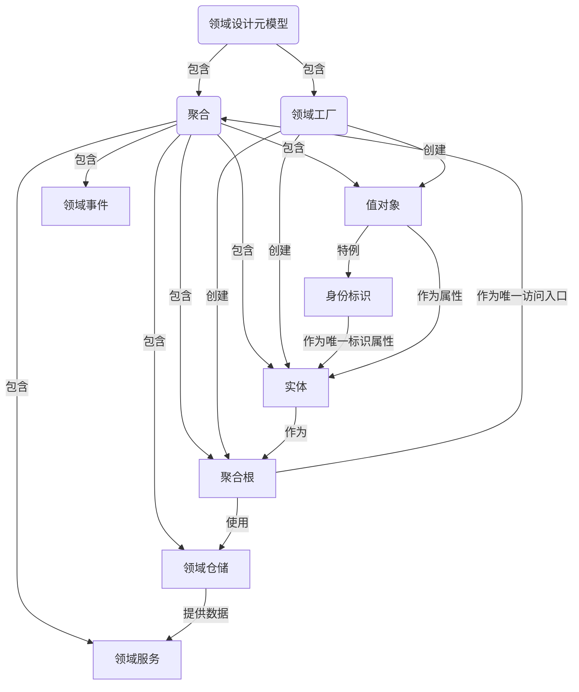
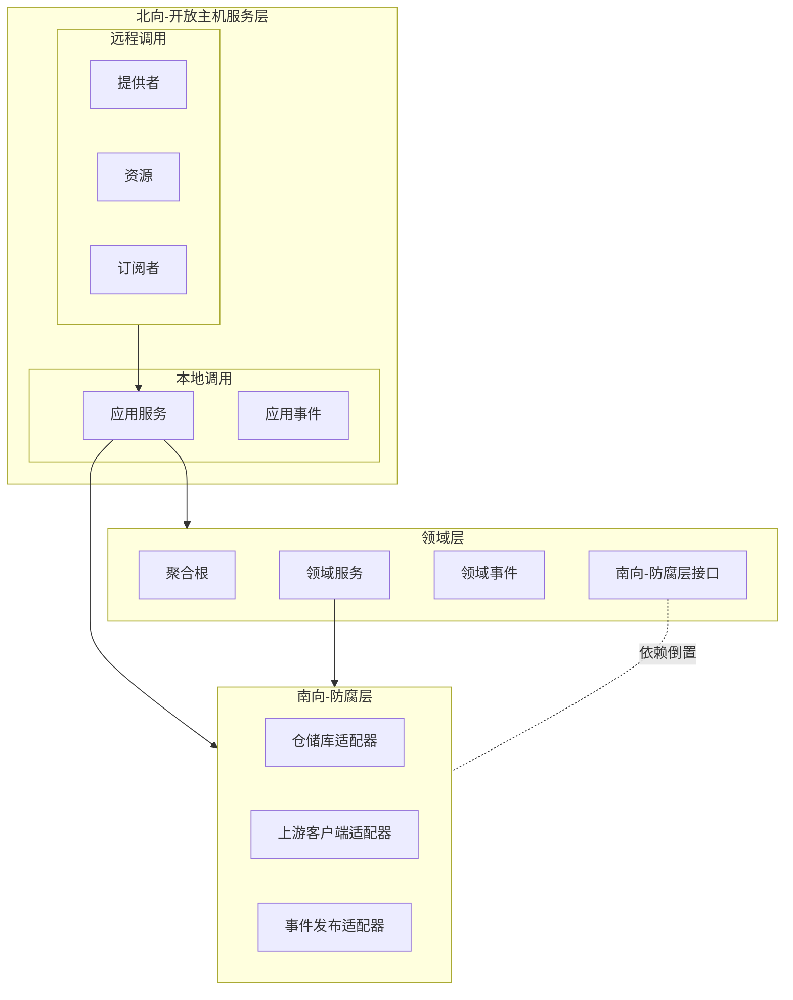

# 领域设计元模型

## 定义

### 实体

* 描述事物的主体，具有唯一身份标识和独立生命周期的对象。
* 身份标识：实体对象的必要标识符，区分不同实体对象的唯一标识。
* 属性：分量、性质、关系、场所、时间、位置和状态等，可以是另一个实体对象或者值对象。
* 行为：引起属性变化和状态迁移的动作。

### 值对象

* 作为实体对象的属性，其生命期完全依赖于所属的实体对象，没有唯一身份标识，不能单独存在。
* 拥有自我验证、自我组合、自我运算等领域行为。
* 可以表达细粒度的领域概念（业务含义、逻辑、验证等），相比于内建的基本类型更有优势。

### 身份标识

* 实体的唯一标识，通常包含通用类型(无业务含义)和领域类型(有业务含义)。是值对象的一个特例。

### 聚合

* 将实体和值对象围绕一个边界组织成一个聚合，选择一个实体作为聚合的根，外部对象仅能持有聚合根的引用。
* 完整的领域概念整体，内部维护这个领域概念的完整性。
* 一个整体参与业务行为的协作，是表达领域知识，封装领域逻辑的自制单元。
* 一个聚合必须满足事务一致性。

### 聚合根

* 聚合根是聚合的唯一访问入口，负责维护聚合内部的一致性和完整性。
* 向外暴露聚合整体的行为。

### 领域服务

* 业务行为无法找到一个实体对象来承担时，可以使用领域服务来实现。

### 领域事件

* 封装了实体的状态，代表了因动作导致的属性或状态变化，是已经发生的事实。

### 领域工厂

将复杂的创建逻辑从聚合根中剥离，保持聚合根的内聚性，同时让创建过程可测试、可复用、易于维护。

### 领域仓储

## 关系

## 其它相关定义和术语

### 属性

用来说明实体的静态特征;组合属性:由值对象或者另一个实体组成的属性,可以有自己的约束规则、组合因子或者领域行为;原子属性:
由基本数据类型或者字符串组成的属性.

### 领域行为

用来说明实体的动态特征，领域行为影响的是对象的内存状态，与持久化无关。

* 变更属性的领域行为，通过满足业务含义的方法来修改实体的属性值，来改变实体的状态。
* 自给自足的领域行为，只用自有的属性值或组合属性的领域行为来完成领域逻辑。
* 互为协作的领域行为，由调用者将另一领域对象作为参数传入来参与实现领域逻辑。

### 不变类(Immutable Class)

* 使用final定义类，并且增加@Immutable注解，并且所有属性都必须是final的，任何操作都返回一个新的对象。
* 使用属性值来判断对象的相等性，而不是使用对象的引用来判断相等性，重写equals()和hashCode()方法，来保证正确比较和使用。

### 类的关系

* 泛化(Generalization)：表示一个类是另一个类的特殊化，体现了通用父类和特定子类之间的关系，子类继承父类的属性和行为。
* 关联(Association)：表示一个类与另一个类之间的关系，包括一对一、一对多和多对多关系。
* 聚合(Aggregation)：表示一个类是另一个类的一部分，体现整体与部分的特征，但它们之间的关系较弱，部分可以脱离整体独立存在。
* 组合(Composition)：表示一个类是另一个类的一部分，体现整体与部分的特征，但它们之间的关系较强，部分不能脱离整体独立存在。
* 依赖(Dependency)：表示一个类依赖于另一个类，通常通过方法参数、返回值或者局部变量来实现。

# 约束

## 控制类的关系

* 去除不必要的关系，保持类之间的关系清晰和简单。
* 降低类之间的耦合度，增强系统的可维护性和可扩展性。
* 避免过度使用继承，优先使用组合和接口来实现代码复用和扩展。
* 避免双向耦合，保持类的单一导航方向。

## 身份标识(Identity)

* 不变类，需符合不变类的定义和特征。
* 实现接口IIdentity,默认泛型为Long

## 值对象(Value Object)

* 不变类(Immutable Class)，需符合不变类(Immutable Class)的定义和特征。
* 无唯一身份标识(No Identity)，没有独立的生命周期，完全依赖于实体，不能单独存在。
* 实现接口IValueObject,并且重写equals()和hashCode()方法，来保证值对象的正确比较和使用。
* 添加注解@DomainModel(DomainMetaModel.ValueObject)

## 实体(Entity)

* 具有唯一身份标识(Identity)，有独立的生命周期。

# DDD技术组件结构

