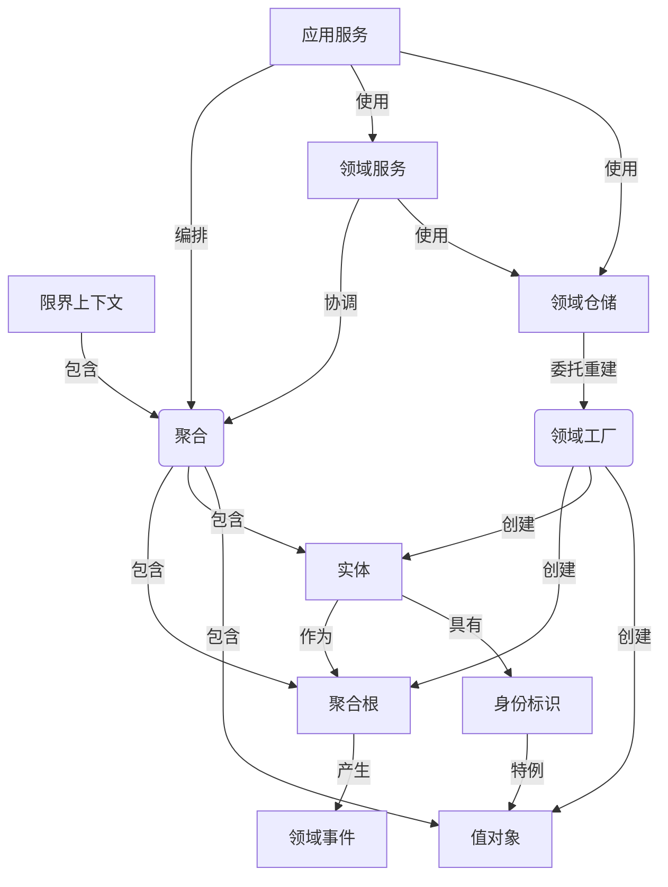
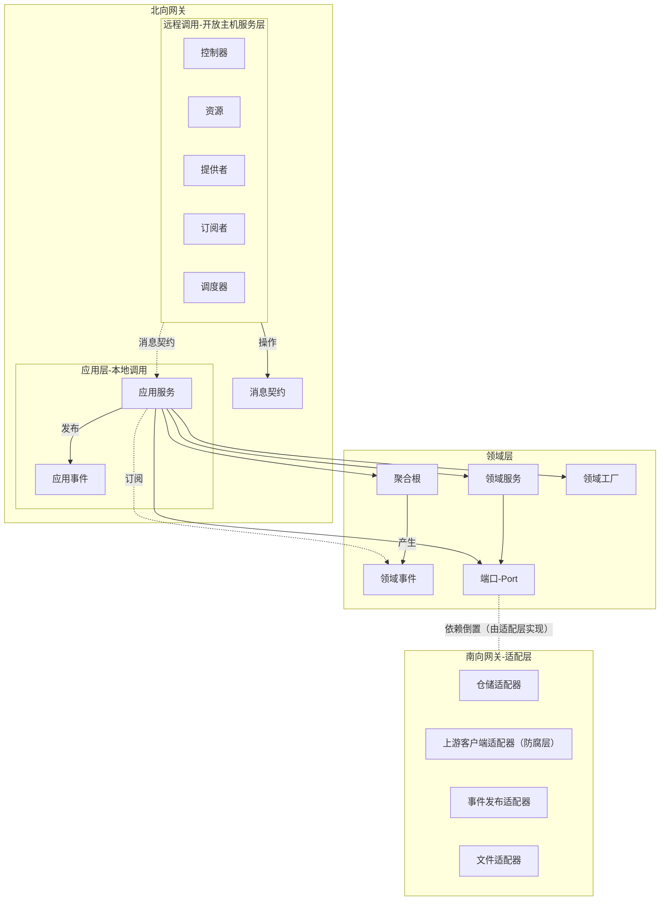

# 亚里士多德哲学

> 本节为领域元模型中"实体—属性"建模提供哲学依据：实体作为独立存在的主语、属性作为依附实体的谓语，对应下文"实体 (Entity)"与"属性 (Attribute)"的划分。

* 范畴定义：是对存在进行分类和描述的最高概念，通过主谓结构 (subject is predicate)来逻辑化地表达存在的特征和关系。
* 范畴内容：实体、数量、性质、关系、场所、时间、位置、状态、动作、受动。
* 主谓逻辑：实体是唯一能充当主语的范畴，其它九个属性范畴只能充当谓语。
* 本体结构：实体 (独立存在)+属性 (依附于实体存在)
  ，实体范畴是存在的中心，是其它范畴的中心。其它范畴都依赖实体，存在于实体之中，不能脱离实体而独立存在，用来规定和说明实体范畴，因而可以概括为"属性"范畴。

# DDD指南

> 本文档用于指导领域驱动设计的战略设计（统一语言、子域划分、限界上下文、上下文映射）与战术设计（聚合、实体、值对象、领域服务、领域事件、领域工厂、领域仓储），
并按照框架约定落地代码结构，也是vibe coding（AI辅助编码）时生成与修改代码的权威规范。每个限界上下文对应一个独立模块，依赖matrix-framework-ddd框架包，框架的注解、标记接口与基类均通过该依赖使用。框架的注解与接口定义位于
src/main/java/wang/liangchen/matrix/framework/ddd，应充分使用。

# 执行准则

* 本文档是生成与修改代码的权威规范；文档约定与业务需求冲突时，以业务语义为准，并输出问题清单交由用户确认，禁止自行臆造业务规则。
* 先设计后编码：按"设计流程"完成各步骤输出物后再生成代码；输入不足（缺少统一语言词汇表、领域场景）时，先补充输入。
* 生成的所有领域模型必须使用框架的注解与标记接口；不得生成违反"约束"与"分层依赖规则"的代码。
* 每轮生成后对照"设计检查清单"自检，未满足项立即修正。
* 模型即代码：修改领域模型时必须同步修改对应代码与文档，保持三者一致。

# 统一语言

* 统一语言 (Ubiquitous Language)是领域专家与开发团队共同维护的领域词汇表，是领域模型的语义基础。
* 统一语言贯穿所有沟通场景：文档、图、代码中的类名、方法名、领域事件名、仓储方法名等命名均以统一语言为准。
* 统一语言在限界上下文边界内有效，每个限界上下文拥有自己的一套统一语言。
* 建模时先通过事件风暴、领域场景分析等方式梳理统一语言，再据此设计领域模型。

# 设计流程

战略设计划定边界（子域、限界上下文、上下文映射），战术设计在边界内完成领域建模，代码映射将模型落地为代码结构。AI设计时应按以下步骤进行，每一步产出明确的工作产品。

## 第1步：需求分析与统一语言

* 输入：业务需求（用户故事、用例、流程描述、业务规则）。
* 活动：梳理领域词汇，明确每个术语的精确定义；可借助事件风暴工作坊梳理业务流程与领域事件（事件风暴工作坊的产出物含领域事件、命令、聚合、参与者、外部系统、策略
  (Policy，事件触发后续动作的业务规则)、读模型 (Read Model，供查询侧展示的信息模型)与热点 (Hot
  Spot，识别出的风险、问题与争议点)等要素；执行顺序为先识别领域事件（过去时态，以Event结尾），再识别触发事件的命令与承载命令的聚合，最后按概念内聚与语义边界划定限界上下文并完成上下文映射），辅助统一语言的形成。
* 判定：术语是否存在歧义？同一概念是否有多个叫法？技术术语是否混入业务描述？
* 输出物：统一语言词汇表（术语+定义），格式为"术语｜英文命名｜精确定义"，作为后续所有模型与代码命名的唯一依据。

## 第2步：战略设计——子域划分

* 活动：从业务价值与技术复杂度两个维度分析业务，将系统划分为三类子域。
* 核心域 (Core)：业务差异化所在，决定产品竞争力，应投入最优质的团队与资源，采用领域模型模式（见"领域模型模式"）。
* 支撑域 (Supporting)：支撑核心业务的非差异化功能，可按成本与质量权衡，采用领域模型模式或事务脚本模式（事务脚本模式按过程组织业务逻辑，不建立领域模型）。
* 通用域 (Generic)：通用基础能力（如认证、通知），优先采购或复用成熟产品与框架。
* 输出物：子域清单及分类（对应框架的DomainType枚举：Core/Supporting/Generic）。

## 第3步：战略设计——限界上下文划分

* 子域与限界上下文的关系：子域是对问题空间的划分，限界上下文是对解决方案空间的划分，二者不必然一一对应。
* 活动：在子域内部，通过业务能力或领域场景识别限界上下文的边界。
* 业务能力 (Business Capability)：组织为实现业务目标所具备的职能或能力，能力之间耦合低、语义内聚、可独立变化，天然适合作为限界上下文的划分依据。
* 领域场景 (Domain Scenario)：业务活动中的具体使用场景，分析场景牵涉的角色、业务活动与数据，按语义相关性与变化原因聚合为限界上下文。
* 判定：一个限界上下文内语义是否一致？同一术语在不同上下文中含义是否不同（语义分歧）？上下文之间的协作是否清晰？
* 规则：同一术语在不同上下文中语义不同（语义分歧）时，必须拆分为不同的限界上下文。
* 输出物：限界上下文图；每个限界上下文标注子域类型（Core/Supporting/Generic）。

## 第4步：战略设计——上下文映射

*

活动：确定限界上下文之间的协作关系，选择上下文映射模式（合作关系、共享内核、客户-供应商、跟随者、防腐层、开放主机服务、发布语言、分离方式、大泥球），模式定义见"上下文映射"；优先评估分离方式——上下文之间无需协作就不建立集成。

* 跨上下文集成时，防腐层与开放主机服务操作的对象应为消息契约，而非各自的领域模型。
* 输出物：上下文映射图；每个集成点标注模式与消息契约（北向/南向）。
* 框架落地：防腐层对应南向IClientPort/IClientAdapter（下游调用上游）；开放主机服务对应北向@Remote
  (Resource/Provider/Subscriber)（上游服务下游）。

## 第5步：战术设计——领域建模

* 活动：在每个限界上下文内完成领域建模，顺序如下：
    1. 识别聚合与聚合根：以不变式、事务边界、完整领域概念为依据划分聚合，选定聚合根；
    2. 识别实体与值对象：以是否需要唯一身份标识为根本判据——有身份者为实体（通常亦有独立生命周期与持续变化的状态），无身份且不变者为值对象，身份标识用值对象表达；
    3. 识别领域行为：将业务行为归属到实体或值对象，无处归属的行为放入领域服务；
    4. 识别领域事件：聚合的重要状态变化发布领域事件（过去时命名，以Event结尾）；
    5. 设计领域工厂与领域仓储：复杂创建用工厂（create/reconstitute），生命周期管理用仓储（以聚合根为单位）；
    6. 设计应用服务与消息契约：每个用例对应一个应用服务方法，定义命令/查询/事件/调度消息契约。
* 决策依据：各元素的引入条件与判定规则见"建模决策规则"。
* 输出物：领域模型（聚合、实体、值对象、领域服务、领域事件、工厂、仓储端口）、消息契约清单、应用服务清单。

## 第6步：代码映射——代码结构落地

*

活动：为每个限界上下文创建独立模块并声明对matrix-framework-ddd框架包的依赖，按框架约定将设计映射为包结构与注解，见"约束"中的包结构与各元素约束。

* 输出物：每个限界上下文的代码骨架（包、接口、注解标注）。

# 建模决策规则

## 实体与值对象

* 判定为实体：需要唯一身份标识（根本判据）；通常同时具有独立的生命周期，且状态随业务行为持续变化。
* 判定为值对象（同时满足）：无身份标识；不可变；以属性值组合定义相等性；生命周期依附于实体或聚合。
* 倾向原则：能建模为值对象就不建模为实体；值对象更简单、更易测试、更易复用。

## 聚合与聚合根

* 聚合划分依据：不变式（恒定业务规则）、事务一致性边界、完整的领域概念。
* 小聚合原则：聚合越小越好，只将必须保持一致的对象放入同一聚合；优先通过领域事件与身份标识引用解除强依赖。
* 聚合根选择：聚合内被外部首先访问、充当唯一入口的实体；外部只能通过聚合根修改聚合内部状态。
* 聚合间协作：通过身份标识引用；同一限界上下文内可通过互为协作的领域行为做瞬态传参协作。

## 领域服务

* 引入条件：业务行为无法归属到任何实体或值对象；或行为代表一个重要的领域过程（domain process）；或行为需要协调多个聚合。
* 不引入：行为可归属实体/值对象；仅包含技术操作（校验、存储、消息发送应放入应用服务或适配器）。

## 领域事件

* 发布条件：聚合内发生重要状态变化，且其它聚合或限界上下文需要感知该业务事实。
* 不发布：纯内部计算、只读数据变化、无关紧要的状态调整。

## 领域工厂

* 引入条件：创建逻辑复杂（多对象组装、依赖初始化、复杂验证规则、reconstitute重建）；或需要保证创建逻辑集中（仓储重建委托工厂）。
* 不引入：构造简单，构造函数足以表达创建意图。

## 应用服务

* 应用服务类以名词命名：{聚合名}{服务类型}ApplicationService，服务类型对应 ApplicationServiceType（Command/Query/Event/Scheduling），与 @ApplicationService 注解保持一致；同一聚合同一服务类型的用例内聚于一个类。
* 用例方法以动宾命名（动词+名词）：一个用例对应一个方法，方法编排领域对象，不包含业务逻辑。
* 命令与查询分离：命令修改状态走聚合并开启事务；查询只读默认经仓储端口读取聚合根，必要时 CQRS 走读模型，不经领域模型变更路径。

# 战略设计元素

## 领域 (Domain)

* 领域是软件系统所要解决的业务问题域，领域驱动设计围绕领域展开建模与设计。
* 子域是对问题空间的划分，限界上下文是对解决方案空间的划分。

## 限界上下文 (Bounded Context)

* 领域模型的语义边界：统一语言与领域模型在限界上下文内保持语义一致。
* 限界上下文同时是团队边界（康威定律：系统结构映射沟通结构）：一个限界上下文宜由一个团队负责维护，团队组织与上下文边界保持一致，避免一个上下文被多个团队分治导致统一语言分裂。
* 通过业务能力或领域场景识别限界上下文的边界。
* 限界上下文的价值在于控制复杂度：边界内高内聚（统一语言与领域模型完整自治），边界间松耦合（仅经消息契约协作），从而可以独立设计、独立实现、独立演进、独立部署。
* 限界上下文是微服务拆分的候选边界：先以限界上下文为单元构建独立模块（模块化单体），确有独立部署与伸缩需要时再演进为微服务——限界上下文不必然等于微服务。
* 限界上下文之间的协作通过上下文映射模式定义（见"上下文映射"）。

## 上下文映射 (Context Map)

限界上下文之间的协作关系，通过上下文映射模式明确集成方式。模式按关注点分为两类：团队协作类（合作关系、共享内核、客户-供应商、遵奉者、各行其道）界定团队之间的协作关系与职责边界；通信集成类（防腐层、开放主机服务、发布语言）界定系统之间的技术集成方式。大泥球不是一种集成模式，而是描述某上下文内部混乱状态的反模式，与其集成时只能经防腐层做防御性隔离（见下）。

* 合作关系 (Partnership)：两个团队/上下文彼此合作，接口随需变更。适用于由同一团队或合作紧密的团队维护的上下文。
* 共享内核 (Shared Kernel)：多个上下文共享一部分模型，需共同维护。仅适用于共享模型较小且稳定、双方能够紧密协调的场景，避免共享过多。
* 客户-供应商 (Customer-Supplier)：下游依赖上游，上游向下游承诺契约。适用于上游处于主导地位、能够向下游承诺契约的场景。
* 跟随者 (Conformist，也作"遵奉者"，二者同义：下游只能跟随上游模型，不做变更。适用于下游对上游无影响力、不得不接受上游模型的场景。
* 防腐层 (Anti-Corruption Layer)：下游在自己的边界内建立隔离层，翻译上游模型，避免上游模型腐化自身领域。适用于下游需要保护自身领域不被上游模型侵入的场景。
* 开放主机服务 (Open Host Service)：上游为下游提供定义良好的协议，配合发布语言供多个下游复用。适用于上游服务多个下游、需要稳定协议的场景。
* 发布语言 (Published Language)：与开放主机服务配套的精确定义、可复用的通信语言；落地为本文档的"消息契约"。
* 大泥球 (Big Ball of Mud)：边界模糊、内部混杂耦合的模型或系统（常见于遗留系统），本质是反模式而非集成模式。与其集成时不得直接依赖或沿用其模型，只能经防腐层做防御性翻译集成，避免混乱渗入自身领域模型。
* 分离方式 (Separate Ways)：上下文之间不存在协作关系，各自独立建模、独立演进，不建立集成。适用于协作成本高于集成收益、各自重复实现反而成本更低的场景。应优先评估：无需协作就不集成。

# 领域模型模式 (Domain Model Pattern)

领域模型模式是战术设计的建模模式选择，与事务脚本模式相对：

* 领域模型模式：以实体、值对象、聚合等战术模式元素组织领域逻辑，业务行为封装在领域对象中，通过对象协作完成业务用例。
* 事务脚本模式：按过程组织业务逻辑，不建立领域模型，简单直接，适合复杂度低的业务。
* 模式选择：核心域采用领域模型模式；支撑域可按成本与质量权衡选择领域模型模式或事务脚本模式；通用域优先采购或复用成熟产品与框架。
*

反模式：贫血模型——领域对象只有属性没有行为，业务逻辑外溢到领域服务或应用服务。领域行为应优先归属实体或值对象（见"领域行为"）。

# 领域元模型

领域元模型是战术设计的基本建模元素，含实体、属性、值对象、身份标识、聚合与聚合根、领域服务、领域事件、领域工厂、领域仓储；其中需以@DomainModel注解标注的七类（Entity/AggregateRoot/ValueObject/DomainService/DomainEvent/DomainFactory/Identity）对应框架DomainMetaModel枚举；属性是实体的组成部分（无独立枚举值），领域仓储以端口（IRepositoryPort）承载（不入枚举）。

## 实体 (Entity)

* 是所要描述的主体，是不同变化状态的本体，具有唯一身份标识和独立生命周期。
* 身份标识：实体必要的标识符，区分不同实体对象的唯一标识，一般用值对象来表达。
* 属性：可以是另外的实体对象或者值对象。
* 行为：引起属性变化和状态迁移的动作。

## 属性 (Attribute)

用来说明实体的静态特征，并持有数据和状态，属性可以是基本数据类型、字符串、值对象或者实体对象。

* 组合属性：由值对象或者另一个实体组成的属性，可以有自己的约束规则、组合因子或者领域行为，有一定的业务语言表达；
* 原子属性：由基本数据类型或者字符串组成的属性。

## 值对象 (Value Object)

* 用来规定和说明实体，它通常作为实体的属性、领域服务的参数或返回值。
* 没有唯一身份标识，通过其属性值的组合来定义相等性。
* 不可变对象，其生命周期通常由所属实体或聚合管理，属性值变化会产生一个新的值对象实例。
* 拥有自我验证、自我组合、自我运算等领域行为。
* 可以表达细粒度的领域概念（业务含义、逻辑、验证等），相比于内建的基本类型更有优势。

## 身份标识 (Identity)

* 实体的唯一标识，值对象的一个特例，具有值对象的特征。
* 无业务含义的通用类型身份标识。
* 有业务含义的领域类型身份标识。
* 按来源可分为自然标识（业务规则赋予的唯一标识）与代理标识（系统生成、无业务含义的标识），通常分别以领域类型与通用类型的身份标识承载（并非硬性对应，自然标识亦可用通用类型承载）。

## 聚合 (Aggregate)

* 将实体和值对象围绕一个边界组织成一个聚合，选择一个实体作为聚合的根，外部对象仅能持有聚合根的引用。
* 聚合表达"整体—部分"关系：整体（聚合）决定部分（内部实体与值对象）的语义与生命周期，部分不能脱离整体独立存在；对外部而言，聚合作为完整的领域概念参与协作。
* 完整的领域概念整体，内部维护这个领域概念的完整性，由聚合根负责维护不变式。
* 一个整体参与业务行为的协作，是表达领域知识，封装领域逻辑的自治单元。
* 聚合是事务一致性的边界：聚合内部的不变式应在一次业务操作中得到维护；跨聚合的状态变更通过领域事件或应用层编排实现最终一致性，避免使用分布式事务。
* 自治性体现为完整性、独立性、不变量 (在数据变化时必须保持的一致性规则)和一致性。

## 聚合根 (Aggregate Root)

* 外部对象只能持有聚合根的引用，并通过聚合根来修改聚合内部状态，负责维护聚合内部的一致性和完整性。
* 聚合根统一对外提供履行该领域概念职责的行为方法。

## 领域服务 (Domain Service)

* 领域服务本身可以表达一个重要的领域概念（领域过程），以统一语言命名，不仅仅是行为的兜底归属。当一个领域行为本质上是一个领域过程，而非某个实体或值对象的职责时，应将其建模为领域服务。
* 业务行为无法找到一个实体或值对象来承担时，可以使用领域服务来实现；也可协调多个聚合完成跨聚合的业务行为。
* 领域服务应是无状态的，可依赖领域仓储及其它领域服务，其方法命名应体现业务语义（动词短语），并遵循统一语言。
* 领域服务的方法应细粒度，每个方法表达一个明确的领域职责，不应将多个不相关的领域行为塞入同一个方法。
* 领域服务应克制使用，领域行为应优先归属实体或值对象，避免业务逻辑外溢导致贫血模型。不应成为过程式编程的退路——不应将所有逻辑放在服务方法中形成事务脚本，而应让实体和值对象承担尽可能多的行为。

## 领域事件 (Domain Event)

* 领域事件表示领域中已经发生的业务事实，通常由聚合内的重要状态变化或业务动作触发。
* 事件中只应包含消费方所需的必要领域数据，而不是简单复制整个实体状态。

## 领域工厂 (Domain Factory)

* 工厂是领域模型的一部分，封装的是领域知识（创建规则、不变式保证），而非技术细节。工厂方法参数应为领域概念（值对象、身份标识等），而非基本类型，以保证领域语义清晰。
* 将复杂的创建逻辑从聚合根中剥离，保持聚合根的内聚性，同时让创建过程可测试、可复用、易于维护。
* 两种创建模式：create（创建全新聚合，执行完整业务验证）与
  reconstitute（从持久化数据重建已有聚合，由领域仓储委托调用；仓储将重建逻辑委托给工厂而非在适配器中直接构造，保证创建逻辑集中）。

## 领域仓储 (Domain Repository)

* 用于管理聚合的生命周期，一个聚合对应一个仓储。
* 领域仓储用于持久化和重建聚合根，为领域层提供面向聚合的集合式访问能力。
* 仓储接口定义在领域层（业务模块中位于domain/port；框架自身的端口基接口位于框架包southbound/port），具体实现位于南向适配层。
* 一般以聚合根为单位建仓储，不直接暴露聚合内部实体的独立仓储。
* 仓储接口的方法应使用统一语言命名（如 orderOf (id)）；框架最小契约提供 findById/save/remove 等通用命名，业务仓储应在此基础上扩展统一语言命名的方法。

## 领域元模型与架构元素关系



# 应用层与消息契约元素

## 应用服务 (Application Service)

*

应用层的用例门面，编排领域对象（聚合根、领域服务、领域工厂、领域仓储）完成用例，不包含业务逻辑。应用服务类以名词命名：{聚合名}{服务类型}ApplicationService（如OrderCommandApplicationService），服务类型对应ApplicationServiceType（Command/Query/Event/Scheduling），与@ApplicationService注解保持一致；同一聚合同一服务类型的用例内聚于一个类，用例方法以动宾命名（如placeOrder()，一个用例对应一个方法）。

* 事务边界与最终一致性的落点：一个用例对应一个事务，一次事务只修改一个聚合实例。
* 负责消息验证、错误处理、监控、日志、访问控制等横切关注点，以及消息契约与领域对象之间的装配。
* 命令与查询分离（CQRS），详见"约束-应用服务"。

## 查询模型 (Query Model)

* 查询模型不属于领域元模型（DomainMetaModel无QueryModel枚举值）：CQRS读侧的模型由视图契约 (IView)
  承载，查询用例只读，不参与领域模型变更路径，默认经领域仓储端口读取聚合根，必要时 CQRS 查询读模型/DTO，经视图 (IView)返回。
* CQRS 的本质：命令侧（走聚合与事务）与查询侧（读模型/视图）职责分离，读模型按查询需要独立建模与优化（必要时绕过领域模型直查读模型或数据存储），读模型允许落后于命令模型（最终一致）。
* 视图契约位于message包，使用@MessageContract (type=MessageContractType.VIEW)标注；读模型不进入领域层。
* 事件溯源 (Event Sourcing)不在本框架默认范围：CQRS 与事件溯源并非必然组合，仅当业务需要完整审计与历史回溯时，由业务自行引入事件溯源机制。

## 领域命令 (Domain Command)

*

命令表达意图，领域事件陈述事实：命令是请求方期望执行的操作意图，可能被拒绝或执行失败；领域事件是不可撤销的既成事实。命令执行成功、聚合状态变更后才发布对应的领域事件；命名上命令用动名词（CreateOrder），事件用过去时态并以Event结尾（OrderPlacedEvent），不得混用。

* 本框架不将领域命令建模为领域对象：命令由消息契约承载（ICommandRequest），命令的验证、装配与执行编排由应用服务完成。

## 应用事件 (Application Event)

* 由应用服务发布的事件，面向应用层的协作与通知，区别于表达业务事实的领域事件。
*

框架中以AbstractApplicationEvent基类表达（位于northbound/event，继承contract/event的AbstractContractEvent，复用事件唯一标识eventId与事件发生时间occurredOn及其值相等语义）。

*

应用事件仅限进程内（应用层）协作与通知，不跨限界上下文发布，不建议携带领域对象引用；具体应用事件类必须继承AbstractApplicationEvent（由框架ArchUnit规则applicationEventsExtendBase守护）。

* 跨限界上下文的事件契约不继承AbstractApplicationEvent，直接继承AbstractContractEvent（见"消息契约"）。

## 装配器 (Assembler)

* 负责消息契约模型与领域对象之间的相互转换：入站将消息契约装配为领域对象（可兼任工厂），出站将领域对象装配为消息契约。
* 装配器位于应用层（northbound/assembler包）；消息契约不能引用领域模型，更不能担任工厂。
* 继承框架的AbstractAssembler基类（基类已实现IAssembler），或直接实现IAssembler接口；并添加注解@Assembler（标注由框架ArchUnit规则assemblersAnnotated守护，放置由assemblerPlacement守护）。

## 消息契约 (MessageContract)

* 跨边界（限界上下文之间、北向/南向）通信的消息模型，用注解@MessageContract标识，对应发布语言 (Published Language)。
* 消息契约是纯数据模型：不能引用领域模型，更不能担任工厂（不得提供toXxx ()
  等方法创建领域对象）。也有消息契约模型自身提供转换方法的方式；本框架统一采用装配器（Assembler）承担领域对象的创建与消息契约的装配，不在消息契约中提供转换方法。
* 操作类型决定消息契约类型（MessageContractType）：命令请求 (COMMAND_REQUEST)、查询请求 (QUERY_REQUEST)、事件 (EVENT)、调度
  (SCHEDULING)，另有通用类型REQUEST/RESPONSE/RESULT/VIEW。
*

契约类型取值（MessageContractType）与标记接口配套：命令请求→COMMAND_REQUEST+ICommandRequest，查询请求→QUERY_REQUEST+IQueryRequest，调度消息→SCHEDULING+ISchedulingRequest，命令响应→RESULT+IResult，查询视图→VIEW+IView，事件契约→EVENT（继承AbstractContractEvent），通用请求→REQUEST+IRequest，通用响应→RESPONSE+IResponse。

* 协作模式决定交换方式：请求/响应 (RequestResponse，用于查询)、即发即忘 (FireAndForget，用于命令)、发布/订阅 (RequestStream)
  、消息通道 (RequestChannel，用于即时通信/IM)，通过@MessageContract的exchangePattern属性声明。
* direction/type/exchangePattern为@MessageContract必填属性（无默认值），强制契约作者显式声明方向、类型与交换方式；版本等技术关注点由消息信封承担，不进入消息契约。
* 请求命名：命令请求动名词+CommandRequest（CreateOrderCommandRequest）；查询请求业务名词或动名词+QueryRequest（OrderQueryRequest、QueryOrdersQueryRequest）；响应命名：查询响应Response、命令响应Result、视图View。
* 为保护领域模型，防腐层和开放主机服务操作的对象都应是消息契约，而不是领域模型。

# 其它相关定义和术语

## 领域行为

用来说明实体的动态特征，领域行为关注业务语义和模型状态变化，不能直接依赖持久化等技术实现细节。

* 变更属性的领域行为，通过满足业务含义的方法来修改实体的属性值，来改变实体的状态。
* 自给自足的领域行为，只用自有的属性值或组合属性的领域行为来完成领域逻辑。
* 互为协作的领域行为，由调用者将另一领域对象作为参数传入来参与实现领域逻辑。
* 查询的领域行为，只读操作，不改变状态，无需事务。
* 领域行为应优先由实体或值对象承担；若业务行为无处归属，才考虑领域服务。将业务逻辑大量外溢到领域服务或应用服务，会形成贫血模型。

## 不变类 (Immutable Class)

* 使用final定义类，并且所有属性都必须是final的，任何操作都推荐返回一个新的对象。
* 使用属性值组合来判断对象的相等性，而不是使用对象的引用来判断相等性，重写equals ()和hashCode ()方法，来保证正确比较和使用。

## 类的关系

* 泛化 (Generalization)：表示一个类是另一个类的特殊化，体现了通用父类和特定子类之间的关系，子类继承父类的属性和行为。
* 关联 (Association)：表示一个类与另一个类之间的关系，包括一对一、一对多和多对多关系。
* 聚合 (Aggregation)：表示一个类是另一个类的一部分，体现整体与部分的特征，但它们之间的关系较弱，部分可以脱离整体独立存在。
* 组合 (Composition)：表示一个类是另一个类的一部分，体现整体与部分的特征，但它们之间的关系较强，部分不能脱离整体独立存在。
* 依赖 (Dependency)：表示一个类依赖于另一个类，通常通过方法参数、返回值或者局部变量来实现。

## 术语约定

* Ubiquitous Language 有"统一语言""通用语言""统一协作语言"等多种译法（均强调其作为领域专家与开发团队协作媒介的性质），本文档统一使用"统一语言"。
* Repository "资源库"，本文档统一使用"仓储"，二者同义。
* Conformist "遵奉者"，本文档行文使用"跟随者"，二者同义。
* Separate Ways "各行其道"，本文档行文使用"分离方式"，二者同义。
* 架构映射：过程三阶段（全局分析→架构映射→领域建模）中指战略设计阶段（系统上下文、限界上下文、上下文映射）。本文档"设计流程"中的战略设计步骤（第2~4步）与之对应；领域模型到代码结构的落地本文档称"代码映射"（第6步），不使用"架构映射"一词，避免与该书术语冲突。
* 端口 (Port)：领域层声明的南向接口，业务端口位于业务模块的domain/port包（框架自身的端口基接口位于框架包southbound/port），由南向适配层实现（依赖倒置），框架中体现为
  IRepositoryPort、IClientPort、IFilePort、IPublisherPort 等。
* 消息契约 (MessageContract)：跨边界通信的消息模型（请求/响应/事件），见"消息契约"。
* 开放主机服务与防腐层为上下文映射模式，定义见"上下文映射"。

# 命名规范

所有命名取自统一语言。类名禁止出现技术后缀（Entity、DO、PO、VO、DTO、Model）、拼音与自造缩写。命名规则汇总：

| 元素           | 命名规则                  | 示例                          |
|----------------|---------------------------|-------------------------------|
| 限界上下文/包  | 业务名词                  | Order、Payment                |
| 聚合/聚合根    | 业务名词                  | Order、Product                |
| 实体           | 业务名词                  | OrderItem、Post               |
| 值对象         | 业务名词                  | Address、Money                |
| 身份标识       | 业务名词+Id               | OrderId、UserId               |
| 领域服务       | 业务名词（或动词名词化）+Service | OrderPricingService、OrderPlacementService |
| 领域服务方法   | 动词短语                  | transfer()                    |
| 领域事件       | 业务名词+过去式动词+Event | OrderPlacedEvent、PaymentConfirmedEvent |
| 领域工厂       | 业务名词+Factory          | OrderFactory                  |
| 仓储端口       | 业务名词+RepositoryPort   | OrderRepositoryPort           |
| 命令请求       | 动名词+CommandRequest     | CreateOrderCommandRequest     |
| 查询请求       | 业务名词或动名词+QueryRequest | OrderQueryRequest、QueryOrdersQueryRequest |
| 调度请求       | 动名词+SchedulingRequest  | ReportSchedulingRequest       |
| 命令响应       | 动名词+Result             | CreateOrderResult             |
| 查询视图       | 业务名词+View             | OrderView                     |
| 事件契约       | 业务名词+过去式动词+Event | OrderPlacedEvent              |
| 应用服务       | 聚合名+服务类型+ApplicationService | OrderCommandApplicationService |
| 应用服务方法   | 用例名（动词短语）        | placeOrder()                  |
| 聚合根行为方法 | 动词短语                  | place()、confirmPayment()     |

# 约束

>
说明：以下约束中涉及的接口与注解（IIdentity、ISimpleIdentity、@Identity、@DomainModel、@DomainPackage、@AggregatePackage、@BoundedContextPackage、@MessageContract、@ApplicationService、@Remote、@Port、@Adapter
等）为本框架的工程约定。

## 统一语言 (Ubiquitous Language)

* 每个限界上下文建立并维护自己的统一语言（领域词汇表）。
* 领域模型、方法、领域事件、仓储方法的命名必须取自统一语言，禁止技术人员自造术语。
* 代码中的命名必须与统一语言一一对应。
* 反模式：禁止在领域类名中使用技术后缀（Entity、DO、PO、VO、DTO、Model）、拼音与自造缩写；技术词与业务词冲突时以业务词为准。

## 限界上下文 (Bounded Context)

* 一个限界上下文拥有独立的统一语言，领域模型在上下文边界内保持语义一致。
* 限界上下文之间通过上下文映射明确集成关系；跨上下文集成采用防腐层、开放主机服务等模式隔离模型。
* 不在限界上下文之间共享领域模型对象（共享内核除外），跨上下文传递数据使用消息契约。
* 同一限界上下文内的聚合协作走进程内调用（应用服务编排）；跨限界上下文集成通过消息契约走进程间通信（REST/RPC/消息），不得跨上下文共享领域模型。
* 限界上下文拥有独立的包结构，根包内创建package-info.java来标识边界，并添加注解@BoundedContextPackage
  (name="{上下文名称}", domainType=DomainType.Core/Supporting/Generic)（domainType标注子域类型，默认Core）。

## 消息契约 (MessageContract)

* 跨边界通信必须通过消息契约，不得直接暴露领域模型对象；防腐层与开放主机服务只操作消息契约。
* 消息契约使用@MessageContract (direction=MessageDirection.NORTHBOUND/SOUTHBOUND, type=MessageContractType.xxx,
  exchangePattern=MessageExchangePattern.xxx)标注；direction/type/exchangePattern必填（无默认值）。
* 消息契约不得引用领域模型对象（发布语言与领域模型隔离），更不能担任工厂（不得提供toXxx ()
  等方法创建领域对象；书中讨论的消息契约自身提供转换方法的翻译方式不落地，统一由装配器担任工厂）；需要携带身份标识时以基本类型值承载（如字符串形式的标识值），禁止直接引用领域身份标识/值对象类型（含框架的IIdentity等，由框架ArchUnit规则messageDoesNotDependOnDomain守护）。
*

契约类型取值（MessageContractType）与标记接口配套：命令请求→COMMAND_REQUEST+ICommandRequest，查询请求→QUERY_REQUEST+IQueryRequest，调度消息→SCHEDULING+ISchedulingRequest，命令响应→RESULT+IResult，查询视图→VIEW+IView，事件契约→EVENT（继承AbstractContractEvent）。

* 领域对象不可序列化直传：领域模型（实体/值对象/领域事件）不实现Serializable，跨边界通信一律经消息契约，由消息总线以发布语言（JSON/Protobuf等）序列化传输。
* 方向约定：北向入站契约（远程服务暴露给调用方的契约）使用MessageDirection.NORTHBOUND；南向出站契约（调用上游限界上下文或第三方服务的契约）使用MessageDirection.SOUTHBOUND。
* 请求契约实现IRequest：命令请求实现ICommandRequest，查询请求实现IQueryRequest，调度消息实现ISchedulingRequest。
* 响应契约实现IResponse：命令响应实现IResult，查询视图实现IView。
*

命名规范：命令请求命名xxxCommandRequest，查询请求命名xxxQueryRequest，调度请求命名xxxSchedulingRequest（动名词+SchedulingRequest）；命令响应命名xxxResult，查询响应命名xxxView/xxxResponse；事件契约命名业务名词+过去式动词+Event。

* 事件契约继承框架的AbstractContractEvent基类（contract/event），使用@MessageContract (type=MessageContractType.EVENT)
  标注。AbstractContractEvent遵守"消息契约不依赖领域模型"的原则（消息契约单独提供给下游），不继承领域元模型：自带字符串值的事件标识eventId与事件发生时间occurredOn，并按eventId与类型实现值相等（幂等消费以eventId为准）。领域事件向外发布前由装配器翻译为继承AbstractContractEvent的事件契约（复制事件标识值与发生时间）。
*

应用层进程内的协作与通知使用应用事件基类AbstractApplicationEvent（位于northbound/event，继承AbstractContractEvent复用事件标识与发生时间，见"应用事件"）；跨上下文事件契约不继承AbstractApplicationEvent。

* 交换模式（exchangePattern）按操作类型选择：查询用RequestResponse，命令用FireAndForget（必要时可请求确认），事件用发布/订阅
  (RequestStream)，调度用FireAndForget或RequestResponse，即时通信用RequestChannel（一致性由框架ArchUnit规则messageContractsAnnotated守护）。
*

契约演进：消息契约是对外承诺，修改必须保持向后兼容——新增字段应为可选（允许缺省或提供默认值），不得删除、改名或修改既有字段的类型与语义；确需破坏性变更时，新建契约类型并行提供，待全部消费方迁移后再下线旧契约。版本号等技术关注点由消息信封承担，不进入契约属性。

## 控制类的关系

* 去除不必要的关系，保持类之间的关系清晰和简单。
* 降低类之间的耦合度，增强系统的可维护性和可扩展性。
* 避免过度使用继承，优先使用组合和接口来实现代码复用和扩展。
* 避免双向耦合，保持类的单一导航方向。

## 领域驱动架构 (Domain Driven Architecture)

*

框架的架构风格对应菱形对称架构（限界上下文内部的架构形态）：分层架构、六边形架构（端口-适配器）与依赖倒置原则的结合，体现"内外分离、南北对称"——内部为领域层（领域模型位于架构核心，不依赖任何外层），外部为网关层；北向网关面向调用方（远程服务+应用服务），南向网关面向外部资源（端口+适配器，依赖倒置：领域层声明端口，适配器实现端口）。北向依赖向内（远程服务→应用服务→领域层）。

* 本文档的包结构即菱形对称架构在限界上下文内的落地：northbound（北向网关：remote 远程服务、local 应用服务、assembler 装配器、event 应用事件、exception 应用异常）、domain（领域层，含 port 业务端口）、southbound（南向网关：adapter 适配器；框架端口基接口亦位于框架包 southbound/port）、message（发布语言，跨边界的消息契约）。
* 端口归属说明：菱形对称架构在概念上将"端口"划归南向网关，本框架依据依赖倒置原则将**业务端口接口**声明在领域层的 domain/port 包（由领域需要驱动、随领域演进），仅将**框架端口基接口**（IRepositoryPort 等）置于框架包 southbound/port，适配器在 southbound/adapter 实现。此为对经典六边形/DIP 的取舍，端口的"南向"语义不变，但物理位置与书中"端口位于南向网关"的表述存在差异，特此说明。
* 分层依赖规则见下节，技术组件结构见"DDD技术组件结构"。

## 分层依赖规则

* 依赖方向：远程服务/消息订阅者 → 应用服务 → 领域层（聚合根、领域服务、领域工厂、端口接口）；南向适配器 →
  端口接口（依赖倒置），不得反向依赖北向（应用层/远程层）。
* 领域层不得依赖应用层、消息契约 (message)与基础设施实现；领域层只依赖统一语言与领域元模型。
* 消息契约不得依赖北向（应用服务、远程服务、应用事件、装配器）：发布语言是自治的通信语言，不引用进程内协作机制（应用事件不作为跨边界发布语言）。
* 应用服务不得依赖远程层与南向适配器实现；应用服务通过端口接口访问外部资源。
* 领域模型与消息契约的转换（装配）只发生在应用服务内（通过装配器）。
* 南向适配器内完成翻译（防腐层特指Client适配器承担的跨上下文隔离），不得向领域层泄漏DO/PO等外部模型。
* 分层依赖规则可由框架提供的ArchUnit规则集守护：业务模块在测试中通过@AnalyzeClasses+@ArchTest引用框架的DddArchitectureRules（见框架包rules目录）。规则集组织：
    *
  layeredDependencyRules：领域层不得依赖消息契约/北向/南向适配器；领域模型类（实体、值对象、事件、工厂，领域服务豁免）不得使用端口；消息契约不得依赖领域模型（含框架领域类型）与北向；端口不得反向依赖适配器；应用服务不得依赖远程层与适配器；远程服务不得直接访问领域对象与适配器；南向适配器不得反向依赖北向。
    *
  domainModelRules：领域命名禁止技术后缀（豁免框架自身基类与标记接口）、领域模型@DomainModel标注及类型匹配、实体身份标识、实体重写equals/hashCode、聚合内部实体封装（含嵌套类）、值对象与事件不可变、领域事件必须继承AbstractDomainEvent（domainEventsExtendBase）、无公共setter、领域对象不实现Serializable（枚举与异常类豁免）、存在领域工厂时聚合根构造方法不得public。
    *
  messageContractRules：契约标注@MessageContract且type/exchangePattern与标记接口匹配（命令FireAndForget、查询RequestResponse、事件RequestStream、调度FireAndForget或RequestResponse）、契约命名规范（xxxCommandRequest/xxxQueryRequest/xxxSchedulingRequest/xxxResult/xxxView）、契约不得提供toXxx
  ()公共工厂方法、message包只放消息契约。
    * packageAnnotationRules：根包@BoundedContextPackage（根包及其子包类均检查）、领域包@DomainPackage、聚合包@AggregatePackage标注存在性。
    *
  architectureAnnotationRules：应用服务@ApplicationService、应用事件继承AbstractApplicationEvent、远程服务@Remote、端口@Port、适配器@Adapter、装配器@Assembler标注存在性，且注解值与所实现标记接口匹配。
    *
  architecturePlacementRules：架构元素的具体实现类必须位于约定包——应用服务→northbound.local、远程服务→northbound.remote、应用事件→northbound.event、装配器→northbound.assembler、适配器→southbound.adapter、消息契约→message、领域模型→domain、业务端口→domain.port（框架自身的端口基接口位于框架包southbound/port，豁免）；并守护装配完整性（message包只放契约、业务端口必须由至少一个适配器实现）。
    *
  另有domainDoesNotDependOnMessage、domainNamingRule、entitiesDeclareIdentity、entitiesImplementEqualsAndHashCode、domainModelClassesDoNotDependOnPorts、applicationEventsExtendBase、domainEventsExtendBase、messageContractsAnnotated、portsAnnotated、assemblersAnnotated、applicationServicePlacement、portPlacement、adapterDoesNotDependOnNorthbound、messageDoesNotDependOnNorthbound、aggregateRootConstructorsNotPublicWithFactory、messagePackageContainsOnlyContracts、portsImplementedByAdapters等单条规则方法可单独引用。
* 框架以optional方式依赖archunit，业务模块需在pom中自行声明archunit测试依赖：
  ```xml
  <dependency>
      <groupId>com.tngtech.archunit</groupId>
      <artifactId>archunit</artifactId>
      <version>1.3.0</version>
      <scope>test</scope>
  </dependency>
  ```

## 身份标识 (Identity)

* 不变类 (Immutable Class)，需符合不变类 (Immutable Class)的定义和特征。如果使用Java，必须用final修饰。
* 实现接口IIdentity（继承自IValueObject）；简单身份标识（包装单值的标识）可实现ISimpleIdentity<T>
  ，通过泛型指定身份标识的值类型；框架另提供IStringIdentity（String值）与ILongIdentity（Long值）两个特化。
* 添加注解@DomainModel (DomainMetaModel.Identity)
* 实现静态工厂方法of，用来将身份标识的值转换为身份标识对象。
*

框架提供通用代理标识UUIDIdentity（不可变，提供of/next静态工厂与值相等实现，of校验UUID字符串格式，非法值抛出IllegalArgumentException）；无业务含义的标识可直接复用，有业务含义的标识使用领域类型身份标识。领域事件的eventId由AbstractDomainEvent以UUID字符串提供，不是领域身份标识类型。

* 标识生成时机：身份标识在创建时生成（工厂/静态工厂/构造函数），不由持久化层生成——代理标识（如UUIDIdentity.next ()
  ）在工厂创建聚合时生成，自然标识在创建时由业务规则赋予；禁止依赖数据库自增主键回填标识，保证聚合根在落库前即持有完整身份（领域模型自治，不依赖存储回填）。

## 值对象 (Value Object)

* 不变类 (Immutable Class)，需符合不变类 (Immutable Class)的定义和特征。如果使用Java，必须用final修饰。
* 没有唯一身份标识 (No Identity)，没有独立的生命周期，其生命周期随所属实体或聚合；实例可独立出现（如领域服务的参数或返回值）。
* 继承框架的AbstractValueObject基类，或直接实现接口IValueObject（record形式只能选后者，并自行重写equals ()和hashCode ()方法，来保证值对象的正确比较和使用）。
*

AbstractValueObject的相等性口径：按全部非static、非transient字段含继承层次比较，数组按内容比较；字段已做缓存以缓解反射开销。派生/懒加载缓存字段不属于值对象属性，必须声明为transient以排除在相等性之外。

* 深度不可变：实例字段应使用不可变类型（String、Instant、自身不可变的值对象等）。当前框架的静态规则不接受集合或Optional字段，因为无法从字段原始类型可靠验证元素的不可变性；需要集合语义时，将其封装为独立的不可变值对象。
* 不可变的校验口径（与ArchUnit规则一致）：接口、枚举与抽象基类不要求final，其具体实现类必须为final。
* 添加注解@DomainModel (DomainMetaModel.ValueObject)

## 实体 (Entity)

* 具有唯一身份标识 (Identity)，有独立的生命周期。
* 所有状态变更通过明确的业务方法完成。
* 方法命名遵循统一语言，体现业务语义。
* 身份标识字段使用@Identity注解标注：有且仅有一个（含继承），字段类型实现IIdentity（由框架ArchUnit规则entitiesDeclareIdentity守护）。
* 继承框架的AbstractEntity基类（纯标记基类，已实现IEntity<ID>
  ，ID为身份标识类型），或直接实现接口IEntity<ID>。身份标识不由基类持有——不同实体的标识属性命名不一定相同（如orderId、userId）；实体自行声明身份标识字段并以@Identity标注，并按身份标识类型与值重写equals/hashCode（实体相等按身份标识定义，由框架ArchUnit规则entitiesImplementEqualsAndHashCode守护）。
* 添加注解@DomainModel (DomainMetaModel.Entity)

## 聚合 (Aggregate)

*

一个聚合内，只有聚合根是public的，其它实体都应是包内可见的（package-private，嵌套类形式的内部实体同样受此约束），外部只能通过聚合根来访问和修改聚合内部的状态；值对象（含身份标识）因跨聚合引用与应用服务传参需要不强制包内可见，以不可变保证安全。

* 聚合的不变量，施加在聚合边界内部各个对象之上，使其遵守一种恒定关系的业务约束。
* Aggregate=IV (Root Entity,{Entities},{Value Objects})（IV 指不变量 Invariant：聚合由一个聚合根、一组实体与一组值对象在不变量约束下构成的整体）
* 一个聚合拥有独立的包结构，包内创建package-info.java来标识聚合边界，并添加注解@AggregatePackage (name="{聚合名称}")
* 聚合之间推荐通过身份标识引用进行关联关系协作。
* 位于同一限界上下文内的聚合，可通过互为协作的领域行为进行瞬态协作：将另一聚合根作为方法参数传入，但不持久持有该引用。
* 实体类型与实例归属：实体类型可被多个聚合根类型使用，但实体实例只能属于一个聚合（书中结论）。
*

类型复用时须通过三项审查（框架扩展准则）：①身份不共享——两处聚合中的实例不得共享同一身份空间，否则应将该实体独立为聚合，其余聚合按身份标识引用；②语义无分歧——语义不同时应各自建模为独立类型，避免共享内核式耦合；③不变式内聚——实体进入某聚合的理由是参与该聚合的不变式维护。

* 一次事务只修改一个聚合实例；跨聚合的状态变更通过领域事件或应用层编排实现最终一致性，避免使用分布式事务。
* 不能在聚合内部使用仓储或其它外部资源端口；仓储由应用服务或领域服务使用，重建聚合时由仓储委托领域工厂的 reconstitute
  方法，而不是工厂访问仓储。该约束由框架ArchUnit规则domainModelClassesDoNotDependOnPorts守护：聚合/实体/值对象/事件/工厂不得依赖端口，领域服务豁免（可依赖领域仓储）。

## 领域服务 (DomainService)

* 应为无状态，不持有业务数据。
* 领域服务本身可以表达一个重要的领域概念（领域过程），以统一语言命名，不仅仅是行为的兜底归属。
* 可依赖领域仓储及其它领域服务，但不应依赖应用层与基础设施层细节。
* 方法应细粒度，每个方法表达一个明确的领域职责，不应将多个不相关的领域行为塞入同一个方法。
* 应克制使用，领域行为优先归属实体或值对象，避免贫血模型。不应成为过程式编程的退路——不应将所有逻辑放在服务方法中形成事务脚本，而应让实体和值对象承担尽可能多的行为。
* 继承框架的AbstractDomainService基类，或直接实现接口IDomainService
* 添加注解 @DomainModel (DomainMetaModel.DomainService)

## 聚合根 (AggregateRoot)

* 是实体的特例，同时也是聚合的唯一入口，外部只能持有聚合根的引用。
* 负责维护聚合内部的不变式，所有跨实体的状态变更必须通过聚合根的业务方法完成。
* 跨聚合只能通过身份标识 (Identity)引用其他聚合根，不能将其他聚合根的对象引用作为属性持久持有。
* 继承框架的AbstractAggregateRoot基类（基类提供领域事件收集raise/events/clearEvents；IAggregateRoot<ID>经基类满足，无需重复实现），或直接实现接口IAggregateRoot<ID>（自行承担领域事件收集）。该内存收集仅用于领域内协调，不替代跨进程事件的可靠投递。
* 添加注解 @DomainModel (DomainMetaModel.AggregateRoot)

## 领域事件 (DomainEvent)

* 不变类 (Immutable Class)，需符合不变类 (Immutable Class)
  的定义和特征。如果使用Java，具体事件类必须用final修饰（抽象基类AbstractDomainEvent/AbstractApplicationEvent豁免）。
* 命名使用过去时态并以Event结尾，体现业务事实，例如 OrderPlacedEvent、PaymentConfirmedEvent。
* 必须包含事件发生时间 (occurredOn)和事件唯一标识 (eventId)
  等基础信息；框架的AbstractDomainEvent基类已提供两者。默认构造使用系统时钟与随机eventId（正常业务路径）；注入构造
  (eventId, occurredOn)用于测试、reconstitute与历史事件回放，保证事件的确定性与可复现。
* 只携带消费方必要的数据，不应是整个聚合根的完整快照。
* 事件基类不继承java.util.EventObject，不携带发布者引用——事件是对已发生事实的陈述，与发布者解耦。
* 事件基类按eventId与类型实现值相等（equals/hashCode/toString），支撑事件幂等消费（以eventId为准）。
*

源聚合标识不进基类：涉及聚合状态变化的领域事件，由具体事件类以业务命名字段携带（如OrderPlacedEvent携带orderId）；源聚合标识可用身份标识值对象类型（如OrderId）承载，也可用基本类型值承载；跨边界发布时由装配器翻译为消息契约的基本类型值。幂等消费以eventId为准。

* eventType/version/traceId等技术关注点由序列化器、消息信封等技术机制承担，不进入领域事件属性，也不进入消息契约属性。
* 领域事件的消费方应保证幂等，并具备重试处理能力。
* 发布时机：领域事件由聚合在业务行为中收集（聚合根通过AbstractAggregateRoot#raise收集）。进程内通知可由应用服务提取events ()（只读快照）并在成功处理后clearEvents ()；不得将该内存队列视为可靠投递机制。
* 跨上下文发布：应用服务将领域事件经装配器翻译为事件契约，并将业务变更与Outbox事件记录置于同一事务；后台投递器通过IPublisherPort异步发布，至少一次投递，消费方按eventId幂等去重。这是保证最终一致性的必要约束。
* 继承框架的AbstractDomainEvent基类（domain/event）。
* 添加注解 @DomainModel (DomainMetaModel.DomainEvent)

## 领域工厂 (DomainFactory)

* 工厂是领域模型的一部分，封装的是领域知识（创建规则、不变式保证），而非技术细节。工厂方法参数应为领域概念（值对象、身份标识等），而非基本类型，以保证领域语义清晰。
* 负责封装复杂的聚合根、实体、值对象的创建逻辑。
* 工厂方法命名应体现业务语义，例如 create、reconstitute（重建已有聚合）。
* create 用于创建全新的聚合，reconstitute 用于从持久化数据中重建聚合。仓储将重建逻辑委托给工厂而非在适配器中直接构造，保证创建逻辑集中——无论
  create 还是 reconstitute，创建规则与不变式保证都统一由工厂承载。
* 继承框架的AbstractDomainFactory基类（位于框架domain/factory包，已实现IDomainFactory并提供requireXxx验证方法），或直接实现接口IDomainFactory；并添加注解 @DomainModel (DomainMetaModel.DomainFactory)
  （注解匹配由框架ArchUnit规则domainModelsAnnotated守护）
* 聚合自身担任工厂，在聚合根中提供静态工厂方法来创建聚合产品实例，聚合产品的构造方法设置为私有。方法可以使用of、valueOf、from等方法名。适用于创建逻辑简单、与聚合自身紧密相关的场景。
* 由被依赖聚合担任工厂，例如 Blog 与 Post 分属两个聚合时，可由 Blog.createPost () 创建 Post 聚合根；若 Post 是 Blog
  聚合的内部实体，createPost 属于聚合根的普通职责，不在此列。
*

专门的聚合工厂，使用工厂类来创建聚合，将工厂类和聚合产品放在同一个包，且将聚合根的构造方法设置为包内可见，来保证聚合根只能通过工厂来创建（存在领域工厂时，聚合根构造方法不得public，由框架ArchUnit规则aggregateRootConstructorsNotPublicWithFactory守护）。适用于创建逻辑复杂、需要独立可测试的场景。

* 装配器担任工厂：装配器位于应用层，入站装配时兼任工厂创建领域对象；消息契约不能引用领域模型，更不能担任工厂。
* 构建者模式组装聚合。

## 领域仓储 (DomainRepository)

* 仅以聚合根为读写单位；
*

接口定义在领域层（业务模块中位于domain/port；框架自身的端口基接口位于框架包southbound/port）、实现位于南向适配层（框架中为IRepositoryPort<
ID, AR>泛型契约：findById（返回Optional）/save/remove (AR)/remove (ID)（按身份标识删除，默认经findById定位后委托remove (AR)
），适配器为IRepositoryAdapter）；

* 不暴露 ORM/DAO 细节；
* 方法命名使用统一语言；框架最小契约提供 findById/save/remove 等通用命名，业务仓储可在此基础上扩展统一语言命名的方法（如
  orderOf (id)）；
* 查询与变更职责分离（必要时 CQRS）；
* save/remove 仅接收聚合根，不暴露内部实体持久化接口；
* 变更方法（save/remove）仅接收聚合根，返回值不泄漏 PO/DO/EntityModel 等基础设施类型（框架最小契约的 save/remove 返回
  void，需要时可返回聚合根等领域对象）；
* 查询职责默认也经本端口：findById 与业务统一语言命名的方法返回聚合根，查询用例只读使用；本端口方法只返回聚合根（资源库返回领域对象），必要时
  CQRS 的读模型/DTO 查询由业务自定义端口或应用层查询组件承载，经视图 (IView)返回。
* 领域模型与数据模型的映射：数据模型（表结构）与领域模型不必一一对应，共表与否是数据模型决策，领域层不感知；仓储适配器完成领域对象与持久化对象之间的翻译。
* 多个聚合的同类实体共用一张表的前提是语义一致；语义分歧的领域概念不应压入同一张表（框架扩展准则）。
* 共表时两条红线（框架扩展准则）：①一次事务仍只修改一个聚合的行；②跨聚合读取走读模型（不经领域模型变更路径），修改对方状态必须经对方聚合根。

## 端口与适配器 (Port & Adapter)

* 领域层通过端口 (Port)
  声明对外部资源的依赖（依赖倒置），业务端口接口位于业务模块的domain/port包（框架自身的端口基接口IRepositoryPort等位于框架包southbound/port）；南向适配层通过适配器
  (Adapter)实现端口。
* 端口接口实现IPort并添加注解@Port (PortType.xxx)；适配器实现IAdapter并添加注解@Adapter (PortType.xxx)
  。默认业务端口应由至少一个适配器实现（由框架ArchUnit规则portsImplementedByAdapters守护）；适配器在独立部署模块或运行时提供时，应在该模块的架构测试中执行等价校验。
* 端口类型与职责（PortType）：
    * Repository：隔离对数据库的访问，对应IRepositoryPort/IRepositoryAdapter；
    * Client：隔离对上游限界上下文或第三方服务的访问，对应IClientPort/IClientAdapter；
    * Publisher：隔离对事件总线的访问，对应IPublisherPort/IPublisherAdapter；
    * File：隔离文件访问，对应IFilePort/IFileAdapter。
* 查询读侧默认经领域仓储端口（PortType.Repository）承担：findById 与业务统一语言命名的查询方法即读通道，返回聚合根供查询用例只读使用；本端口只返回聚合根，必要时
  CQRS 的读模型/DTO 查询由业务自定义端口（实现 IPort）或应用层查询组件承载，经视图 (IView)返回——框架因此不设独立的查询端口类型。
* 适配器内完成翻译：将外部模型（DTO/DO/第三方契约）翻译为领域对象或消息契约，外部技术细节不得渗入领域层；其中Client适配器承担跨上下文的防腐层职责（隔离上游模型），仓储/发布器/文件适配器为资源隔离。

## 应用服务 (ApplicationService)

* 应用层门面，负责用例编排，不包含业务逻辑。
* 事务边界：一个应用服务方法（一个用例）对应一个事务，一次事务只修改一个聚合实例。
* 负责消息验证、错误处理、监控、日志、访问控制等横切关注点，以及消息契约与领域对象之间的装配（通过装配器）。
* 跨聚合协作的编排、领域事件与应用事件的发布与订阅由应用服务完成（最终一致性的落点）。
* 跨限界上下文的长流程协作（长时处理，需多个上下文按步骤协同并支持补偿）由业务按需引入SAGA模式（编排Orchestration或协同Choreography）实现最终一致性，本框架不默认提供。
*

命令与查询分离（CQRS）：命令用例实现ICommandApplicationService，接收ICommandRequest，返回IResult；查询用例实现IQueryApplicationService，接收IQueryRequest，返回IView；事件消费实现IEventApplicationService；定时任务实现ISchedulingApplicationService。

* 命令用例在应用服务内开启事务并修改聚合；查询用例只读，不走领域模型变更路径，默认经领域仓储端口读取聚合根（必要时 CQRS
  查询读模型/DTO），经视图 (IView)返回。
* 实现接口 IApplicationService（按职责选用上述子接口；基接口不携带@ApplicationService注解）
* 添加注解 @ApplicationService (ApplicationServiceType.COMMAND/QUERY/EVENT/SCHEDULING)
  ：value必填（无默认值）；子接口虽携带该注解，但@Inherited仅对类继承生效，接口上的注解不会传播给实现类，业务类必须自行标注。

## 北向远程适配 (Remote)

* 北向远程调用构成开放主机服务层，远程服务实现IRemote接口并添加注解@Remote (RemoteType.xxx)。
* 远程服务类型与消息契约（RemoteType）：
    * Controller：面向UI，消息契约模型为Presentation/View，对应IControllerRemote；
    * Resource：服务资源契约，面向下游限界上下文或第三方调用者，消息契约模型为Request/Response（一般为RESTful），对应IResourceRemote；
    * Provider：服务行为契约，面向下游限界上下文或第三方调用者，消息契约模型为Request/Response或FireAndForget（一般为RPC），对应IProviderRemote；
    * Subscriber：服务事件契约，消息契约模型为Event，对应ISubscriberRemote；
    * Scheduler：定时调度契约，对应ISchedulerRemote。
* 远程服务的对外方法只暴露消息契约，并通过应用服务完成用例编排，不直接访问领域对象与南向适配器（外部资源访问须经应用服务与端口）。ArchUnit守护直接领域对象与适配器依赖；API签名和调用路径需在代码评审中确认。
* 部署无关的开放主机服务接口（可选）：除以@Remote远程服务直接暴露协议外，上下文也可在契约模块（message同级的service包）额外声明面向下游的应用服务接口（如OrderCommandService/ProductQueryService），方法只操作消息契约、不暴露领域模型。该接口单体部署时由应用服务本地实现（northbound.local），微服务部署时由client模块的远程适配器（Feign等）实现，下游只依赖此接口即可对部署形态无感知。接口本身不实现IRemote，故不受远程服务放置规则约束；其两种实现分别落位northbound.local与client模块。

## 异常 (Exception)

*

领域层业务规则违反时抛出框架的AbstractDomainException（RuntimeException，位于domain/exception，实现IDomainException），消息使用统一语言描述业务含义；领域异常仅表达业务规则违反。

*

应用层捕获AbstractDomainException后包装为AbstractApplicationException（位于northbound/exception，实现IApplicationException）向外抛出，消息可附加用例信息（如用例名称、消息契约名）。

* 领域层不得依赖应用层异常。
*

基础设施层异常（如数据库、网络错误）不属于领域语义：适配器保留技术异常（或包装为基础设施异常类型），由应用服务捕获并统一包装为AbstractApplicationException，避免技术细节泄漏到领域层，也避免领域异常被技术故障污染。

## 包结构

*

每个限界上下文对应一个独立模块（如Maven模块），统一依赖matrix-framework-ddd框架包；框架包提供领域元模型注解、标记接口与基类（@BoundedContextPackage、@DomainPackage、@AggregatePackage、@DomainModel、@Identity、@MessageContract、@Port、@Adapter、@Remote、@ApplicationService、IEntity、IIdentity、AbstractDomainEvent、AbstractContractEvent、AbstractApplicationEvent等），业务模块通过依赖使用，不复制框架代码。

* 每个限界上下文一个根包，根包的package-info.java添加@BoundedContextPackage (name=..., domainType=...)。
* 领域层包（domain）的package-info.java添加@DomainPackage；每个聚合一个独立子包，聚合包的package-info.java添加@AggregatePackage
  (name="{聚合名称}")。
* 包内布局遵循框架结构：
    *
  domain：领域模型（聚合根、实体、值对象、身份标识、领域服务、领域事件、领域工厂）；domain/port：业务端口接口（继承框架的IRepositoryPort等基接口，领域层声明的南向依赖；框架自身的端口基接口位于框架包southbound/port）；
    *
  message：消息契约（请求/响应/事件）；框架的契约注解、契约标记接口与事件契约基类（@MessageContract、ICommandRequest、AbstractContractEvent等）位于框架包的contract（contract/request、contract/response、contract/event）子包，业务模块通过依赖使用；
    *
  northbound/local：应用服务；northbound/assembler：装配器（消息契约与领域对象互转，位于应用层）；northbound/event：应用事件（AbstractApplicationEvent）；northbound/remote：远程服务；northbound/exception：应用层异常；
    * southbound/adapter：南向适配器实现。
* 仅聚合根与其所属包对外可见，聚合内部实体保持包内可见；值对象（含身份标识）可对外可见。
* 聚合包内组织：聚合根、内部实体、值对象、身份标识、领域事件、领域工厂位于同一聚合包内。

# DDD技术组件结构



# 设计检查清单

设计完成后，按以下清单自检，未满足项应回到对应设计步骤修正。

## 战略设计检查

* 统一语言词汇表是否覆盖全部核心业务术语，且无歧义、无同义多词？
* 子域是否完成核心域/支撑域/通用域分类？核心域是否采用领域模型模式？
* 限界上下文边界是否语义内聚、可独立变化？是否存在跨上下文的语义分歧未处理？
* 上下文映射是否覆盖全部集成点？是否评估了分离方式（无需集成即不集成）？防腐层/开放主机服务是否只操作消息契约？
* 每个限界上下文是否标注子域类型（DomainType）？

## 战术设计检查

* 聚合是否满足Aggregate=IV (Root Entity,{Entities},{Value Objects})？不变式是否明确？
* 是否保证一次事务只修改一个聚合实例？跨聚合协作是否通过领域事件或应用层编排？
* 聚合之间是否通过身份标识引用？瞬态协作是否只出现在方法参数中？
* 聚合内部是否未使用仓储或外部端口？
* 值对象是否不可变、无身份、重写了equals/hashCode？是否存在值对象被误建模为实体（或有独立生命周期却无身份）？
* 实体状态变更是否全部通过业务方法完成，无公共setter（框架规则按set[A-Z]前缀拦截公共setter方法，合法的领域行为应使用体现业务语义的动词短语命名，避免set开头）？
* 领域行为是否优先归属实体/值对象？领域服务是否克制使用、无状态？
* 领域事件是否过去时命名且以Event结尾、携带occurredOn/eventId、只含消费方必要数据？
* 仓储是否以聚合根为读写单位、只返回聚合根（读模型/DTO查询由自定义端口或查询组件承载）？
* 应用服务是否不含业务逻辑？命令/查询是否分离（CQRS）？
* 领域模型是否未依赖消息契约？领域行为是否未依赖持久化等技术实现细节？

## 代码落地检查

以下检查项绝大部分已由框架ArchUnit规则集守护（layeredDependencyRules/domainModelRules/messageContractRules/packageAnnotationRules/architectureAnnotationRules/architecturePlacementRules，见"分层依赖规则"），业务模块在测试中引用规则集即可自动执行；规则未覆盖的语义性检查（事件过去时命名且以Event结尾、统一语言取词、领域行为归属等）仍需人工评审。

* 每个限界上下文根包是否有package-info.java并添加@BoundedContextPackage (name=..., domainType=...)？
* 领域层包是否添加@DomainPackage？每个聚合包是否添加@AggregatePackage (name=聚合名称)？
* 领域对象是否添加@DomainModel (DomainMetaModel.xxx)
  并实现对应接口（IEntity/IAggregateRoot/IValueObject/IIdentity/IDomainService），注解值与类型匹配？
* 实体身份标识字段是否添加@Identity（有且仅有一个，字段类型实现IIdentity）？
* 消息契约是否实现ICommandRequest/IQueryRequest/ISchedulingRequest/IResult/IView（事件契约继承AbstractContractEvent）并添加@MessageContract
  (direction=..., type=..., exchangePattern=...)（三项必填），type与标记接口匹配？
* 消息契约是否未引用领域模型、未提供创建领域对象的工厂方法（如toXxx ()）？
* 消息契约命名是否匹配类型（xxxCommandRequest/xxxQueryRequest/xxxSchedulingRequest/xxxResult/xxxView）？
* 应用服务是否实现对应I*ApplicationService并添加@ApplicationService (ApplicationServiceType.xxx)（必填），类型匹配？
* 远程服务是否实现I*Remote并添加@Remote (RemoteType.xxx)，类型匹配？
* 端口（domain/port）是否实现IPort并添加@Port (PortType.xxx)？适配器是否实现IAdapter并添加@Adapter (PortType.xxx)
  ？南向适配器是否未反向依赖北向？
*

领域事件是否继承AbstractDomainEvent基类？应用事件是否继承AbstractApplicationEvent基类（northbound/event，由框架ArchUnit规则applicationEventsExtendBase守护）？事件契约是否继承AbstractContractEvent基类（contract/event）？

* 领域模型是否未实现Serializable（领域对象不可序列化直传，跨边界通信一律经消息契约；枚举与异常类豁免）？
* 依赖方向是否满足分层依赖规则（领域层未依赖应用层/消息契约/基础设施）？
* 命名是否全部取自统一语言，无技术后缀（Entity/DO/PO/VO/DTO/Model）、拼音、缩写？
* 聚合包内非聚合根实体是否保持包内可见（聚合内部实体只能经聚合根访问）？
* 值对象与领域事件的具体实现类及其实例字段是否全部final（不可变；接口、枚举与抽象基类豁免）？领域类是否存在公共setter？
* 值对象继承AbstractValueObject时，派生/懒加载缓存字段是否声明为transient（排除在相等性之外）？
* 注解是否由业务类自行标注（@Inherited仅对类继承生效，接口上的注解不会传播给实现类）？
*

架构元素的具体实现类是否位于约定包（应用服务→northbound.local、远程服务→northbound.remote、应用事件→northbound.event、装配器→northbound.assembler、适配器→southbound.adapter、消息契约→message、领域模型→domain）？message包内是否只有消息契约？

* 业务端口是否由至少一个适配器实现？
* 存在领域工厂时，聚合根构造方法是否非public？
* 身份标识是否在创建时生成（工厂/静态工厂），未依赖持久化层回填？
* 消息契约修改是否保持向后兼容（新增字段可选，未删除/改名/改类型既有字段）？破坏性变更是否以新契约并行、迁移后下线？